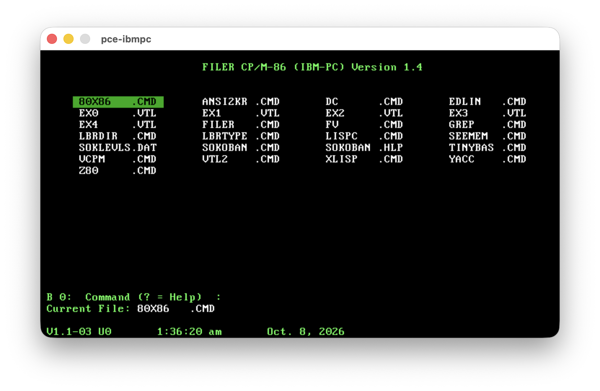
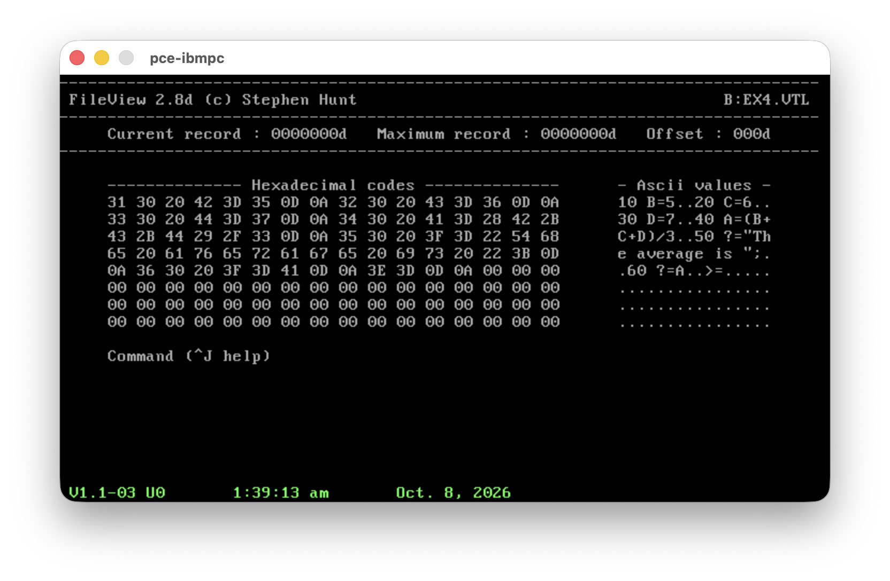
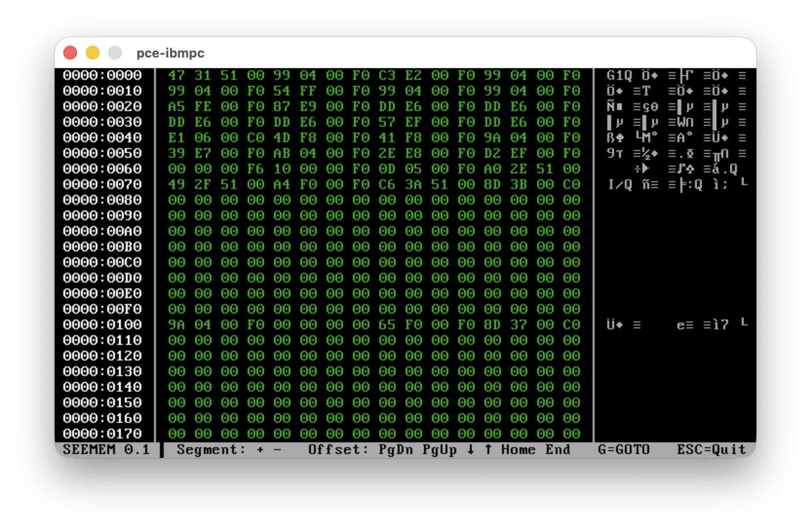
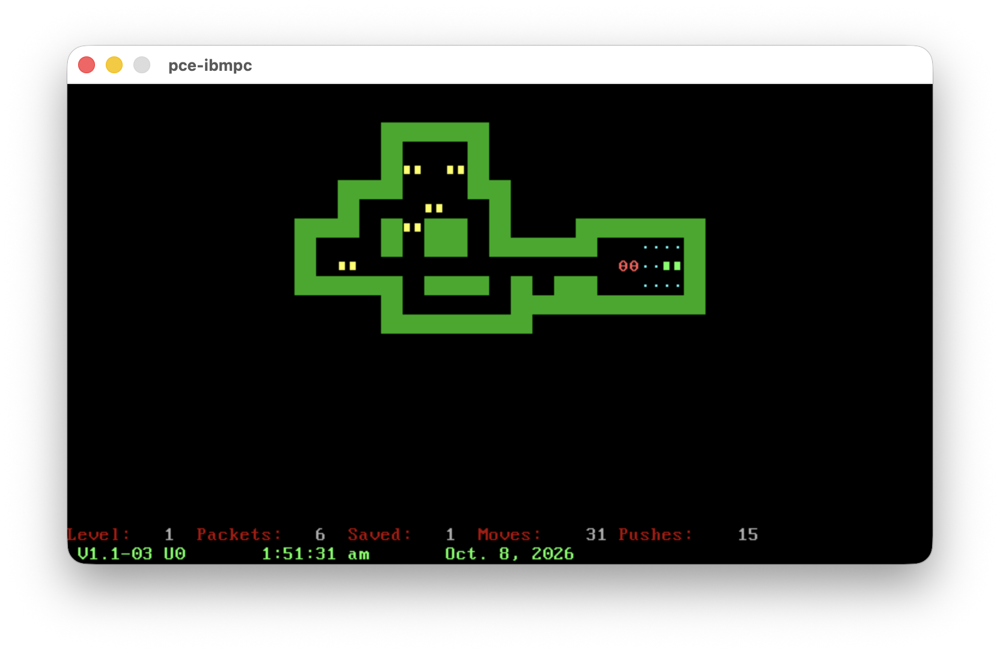
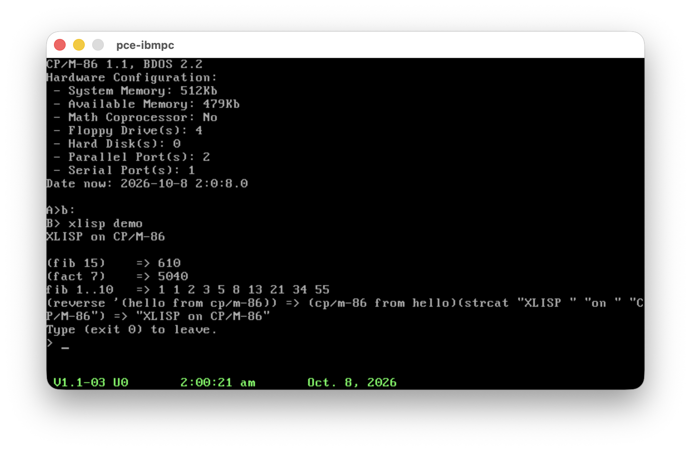
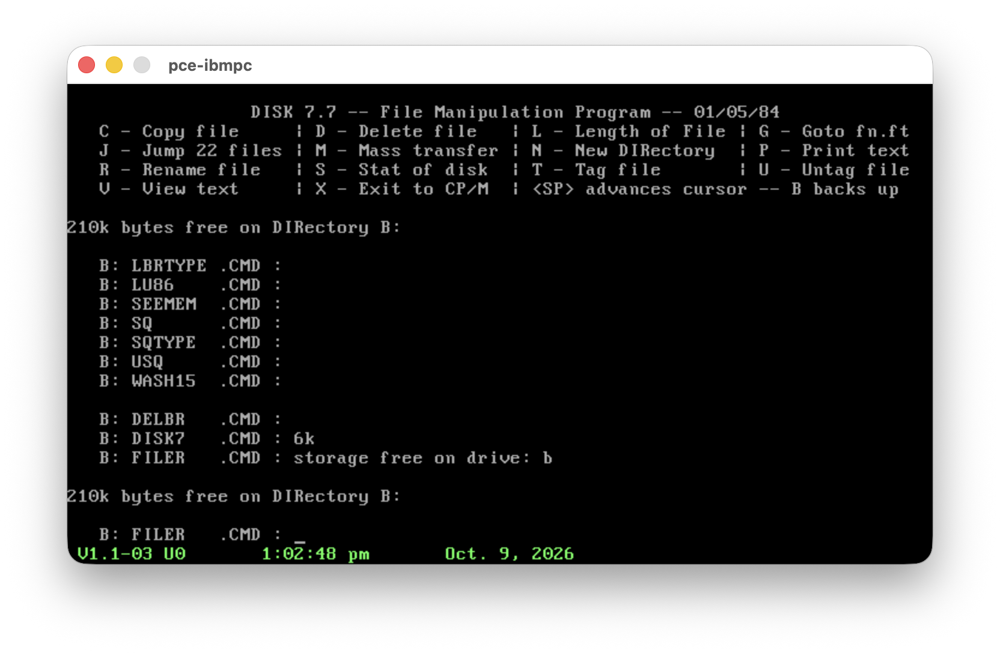

# CP/M-86 Ports

A small collection of classic software tools adapted or ported for CP/M-86. The repository contains language interpreters, compilers, conversion utilities, and other retro-computing experiments assembled for the CP/M environment. All are rebuilt some source, and cleansed, and tested and curated progressively. Please do not hesitate to raise issues.

In particular, those tools give a much more friendly user interaction with the old and crude CP/M-86 1.1 that is otherwise reminiscent of CP/M-80 2.2 which is its base.

- file compression
- library management
- disk sweepers
- emulation
- unix like tools
- development tools

Further tools are available from companion projects:
| Category | Tools | Project |
|---|---|---|
| unix like tools | mv, ls, wc, more, touch | [CP/M-86 Hacking Tools](https://github.com/tsupplis/cpm86-hacking) |
| submit tools | pause, cls, wait | [CP/M-86 Hacking Tools](https://github.com/tsupplis/cpm86-hacking) |
| general cli tools | copycon, mem, mode, tod, zpdump, rtc/at time, dump, conio demos | [CP/M-86 Hacking Tools](https://github.com/tsupplis/cpm86-hacking) |
| vi editor | vi | [CP/M-86 VI](https://github.com/tsupplis/cpm86-vi) |
| menus and submit orchestration | menu, msub | [CP/M-86 Menu](https://github.com/tsupplis/cpm86-menu) |
| microsoft basic | msbasic | [CP/M-86 MS-BASIC](https://github.com/tsupplis/cpm86-msbasic) |
| vedit editor | vedit | [VEDIT Project](https://github.com/johnsonjh/VEDIT) |

Ancillary goals:
- They also expose some practices of CPM/M-80 to CPM/M-86 translation. 
- This project is also used as a soak testing and source for [CP/M-86 Cross Developement Environment] (https://github.com/tsupplis/cpm86-crossdev] ...

<p align="center">


<br><sub>filer (VFILER file manager) &nbsp;·&nbsp; fv (FileView hex/ASCII editor)</sub><br>


<br><sub>seemem (memory browser) &nbsp;·&nbsp; sokoban</sub><br>


<br><sub>xlisp &nbsp;·&nbsp; disk7 (DISK7 full-screen file manager)</sub>
</p>

## Included projects

### Unix-like tools

| Project | What | From | License |
| --- | --- | --- | --- |
| dc | Arbitrary precision reverse Polish desk calculator | Plan 9 / Unix Research Edition dc | MIT |
| diff | Compare two files line by line | RetroBSD / BSD Unix diff | BSD 3-Clause |
| grep | Search a file for a pattern | RetroBSD / DiscoBSD, originally Berkeley grep | BSD 3-Clause |
| sed | Stream editor | RetroBSD / BSD Unix sed | BSD 3-Clause |


### CP/M-80 culture

| Project | What | From | License |
| --- | --- | --- | --- |
| disk7 | DISK7, a full-screen file manager, translated from CP/M-80 with XLT86 | Frank Gaudé | Non-commercial (© 1984) |
| filer | VFILER, a full-screen file manager | ZCPR2 VFILER by Rich Conn, CP/M-86 translation by H. M. Van Tassell | Public domain / Abandonware |
| fv | FileView, view and amend a file in hex and ASCII | Stephen Hunt | Public domain |
| lbr | LU library (.LBR) tools: luu creates and maintains libraries (add, list, extract, print, delete, reorganize), lbrdir lists a library, lbrtype types a member, delbr extracts all members | lu86 / Stephen C. Hemminger, Bill Bolton; lbrdir/lbrtype by Charlie Godet-Ceraolo; delbr by Jeff Martin | Public domain / Abandonware |
| seemem | Full-screen memory browser for CP/M-86 on the IBM PC | Frank Kotler and Kirk Lawrence | Freeware / Public domain |
| wash15 | WASH, a directory maintenance utility, translated from CP/M-80 with XLT86 | Michael J. Karas, Simon J. Ewins | Public domain, non-commercial |
| xsq | xsq, xusq and xtype: squeeze, unsqueeze and type squeezed (.?Q?) files | Richard Greenlaw, with Dick Greenlaw, Chuck Forsberg and W. Earnest | Public domain / Abandonware |

### Games

| Project | What | From | License |
| --- | --- | --- | --- |
| sokoban | Sokoban puzzle game for VT52 terminals | CP/M-80 C sources | Freeware / Copyright |

### Development tools and interpreters

| Project | What | From | License |
| --- | --- | --- | --- |
| ansi2kr | ANSI C to K&R C converter for BDS C and MSX-C | masakioba / upstream ansi2kr sources | BSD 2-Clause |
| cpu | CPU tools: 80x86 (8080-to-8086 source translator), vcpm (V20 hardware 8080 emulator), z80 (software 8080 emulator) and cpuid (processor detection) | Harold V. McIntosh; Stephen Hunt; Pat Hester and Bill Earnest; Richard C. Leinecker and Kirk Lawrence | Mixed / Freeware |
| tinybas | Tiny BASIC interpreter | Classic Tiny BASIC sources | Public domain / Abandonware |
| xlisp | Lisp interpreter and runtime | David Betz | Public domain / Abandonware |
| yacc | YACC-compatible parser generator | RetroBSD / original yacc sources | BSD-style |

### Archaeology

| Project | What | From | License |
| --- | --- | --- | --- |
| edlin | Edlin line editor port from PC DOS 1.1 | Microsoft sources | MIT |
| vtl2 | VTL-2 interpreter; regression test for the XLT86 CP/M-80→86 translator | MITS VTL-2 source, adapted for CP/M | Public domain / Abandonware |

## Build notes

The root Makefile builds the subprojects in order:

```sh
make
make clean
```

Each subdirectory typically contains its own Makefile and CP/M or DOS build artifacts.

## Cross-development environment

For a CP/M-86 cross-development setup, see:

https://github.com/tsupplis/cpm86-crossdev

## Notes

This repository is mainly a collection of historical software ports and adaptations, not a single monolithic application. Licensing remains mixed because each project keeps its own original upstream terms where applicable.

## Summary

The goal of this collection is to keep small classic programming tools usable in a CP/M-86 environment, while preserving the original source material and the spirit of the original software.

--

## Companion projects

| Project | Description |
|---------|-------------|
| [cpm86-kernel](https://github.com/tsupplis/cpm86-kernel)     | CP/M-86 1.1 distribution rebuilt from patched and reconstituted sources |
| [ccpm86-y2k](https://github.com/tsupplis/ccpm86-y2k)         | CCP/M-86 3.1 distribution rebuilt from patched and reconstituted sources |
| [cpm86-crossdev](https://github.com/tsupplis/cpm86-crossdev) | Unix CP/M-86 cross development project (compilers, emulation and tools) |
| [cpm86-hacking](https://github.com/tsupplis/cpm86-hacking)   | CP/M-86 miscellaneous tools and PCE emulator helpers |
| [cpm86-cmdtools](https://github.com/tsupplis/cpm86-cmdtools) | CP/M-86 `.cmd` file manipulation tools |
| [cpm86-ports](https://github.com/tsupplis/cpm86-ports)       | CP/M-86 application ports in C and assembler |
| [cpm86-vi](https://github.com/tsupplis/cpm86-vi)             | STevie vi port for CP/M-86 and PC-DOS 1.1 |
| [cpm86-msbasic](https://github.com/tsupplis/cpm86-msbasic)   | A recreaction of msbasic-86 for CP/M-86 and PC-DOS 1.1 from gwbasic sources |
| [cpm86-menu](https://github.com/tsupplis/cpm86-menu)   | A submit replacement and a menu system for submit orchestration |
| [pcdos11-hacking](https://github.com/tsupplis/pcdos11-hacking) | PC-DOS 1.1 distribution, tools and notes |
